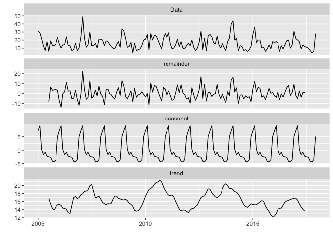

In 2016, we worked with fellows from the Data Science for Social Good
program at the University of Chicago. Our challenge was to identify
which water mains in the city of Syracuse had the highest risk of
breaking. Water main breaks happen often in the city, and when they
break, people lose access to drinkable water, and the fix is expensive.

A write up of the project is
[here](https://dssg.uchicago.edu/2017/01/23/preventive-care-for-the-citys-circulatory-system/)
and the code they wrote is
[here](https://github.com/dssg/syracuse_public).

I was pleased to see someone in Toronto used their open data site to do
some analysis on their [water main
breaks](https://opendatascience.com/blog/watermain-breaks-in-the-city-of-toronto/?utm_content=66583225&utm_medium=social&utm_source=twitter).
I thought it might be fun to duplicate that analysis with Syracuse data.

Data for water main breaks in Syracuse are available
[here](http://data.syrgov.net/datasets/water-main-breaks/data). We have
data since 2004

First we read in the data and clean it to prepare for visualization and
analysis

Then we summarize the data to see how many breaks happen by month, week,
and year

    month.wm <- wm.df %>% count(month) #month
    week.wm <- wm.df %>% count(week)
    year.wm <- wm.df %>% count(Year)

Next we look at the number of water main breaks by week over the course
of the dataset's history.

It appears that there are periodic spikes in the number of breaks.

    ggplot(data = week.wm, aes(x=week,y=n)) +
      geom_line() + labs(title = "Watermain Breaks in Syracuse (2005-2017)",
                         x = "Year", y = "Number of Breaks per Week") +
      scale_x_datetime(date_breaks = "2 years", date_labels = "%Y") + theme_minimal()

Because it looked like there were periodic spikes, seasonality might
have something to do with when breaks happen. So no we will look at a
boxplot of the number of breaks by month to see the distribution, and if
in fact there are more breaks happening at certain times.

    mth.wm <- wm.df %>% group_by(month,Year) %>%
      count(month) %>%
      mutate(month_n = as.factor(month(month, label = T)))
    mthwk.wm <- wm.df %>% group_by(week,month,Year) %>%
      count(week,month,Year) %>%
      mutate(month_n = as.factor(month(month, label = T))) %>%
      mutate(yweek = week(week))

The boxplot does seem to show a slight trend where there are more breaks
in winter months.

    ggplot(mth.wm, aes(x=month_n,y=n)) +
      geom_boxplot(aes(group=month_n)) +
      labs(title = "Seasonality of Watermain Breaks in Syracuse (2005-2017)",
           x = "Month", y = "Number of Breaks") + theme_minimal()

We can check this further by converting the data to timeseries and again
seeing how many breaks happen per month.

    m.ts <- ts(month.wm$n, start=c(2005,1), frequency=12)
    autoplot(m.ts, main = "Time Series Watermain Breaks per Month in Syracuse")

Then, decomposing the dataset we can focus in on trends while
controlling for the season. We see that there is a definite seasonal
trend, but still a lot else going on in the data. In the Data Science
for Social Good project, we did not consider the time of year for breaks
because we were more interested in the water main quality rather than
the weather (which we had no control over). That project showed that
features like material, age, and previous breaks were the major factors
in why water mains break. Because much of the system is old, there may
be other factors that come into play beyond just season.

    autoplot(decompose(m.ts, type = "additive"))

    ## Warning: attributes are not identical across measure variables;
    ## they will be dropped

    ## Warning: Removed 24 rows containing missing values (geom_path).

Finally we'll look at the map of the breaks by year. We see that breaks
are happening all over the city, though in the DSSG project we saw some
parts of the city with a higher density of breaks - downtown and Hawley
Green amongst them. Some of the dots to the left of the city are
happening along the major conduit lines that bring the water from
Skaneateles Lake to the city.

    title.size <- 20
    ggplot(data = wm.df, aes(x = X_coord, y = Y_coord, color = Year)) +
      geom_point(size = 1.5, alpha = 0.4) +
      scale_color_viridis(option = "B") +
      labs(title = paste0("Map of Watermain Breaks"),
           subtitle = paste0("City of Syracuse (2005-2017)")) +
      theme(axis.text = element_blank(), axis.title = element_blank(),
            axis.ticks = element_blank(), panel.background = element_rect(fill = "grey95",colour = "grey5"),
            legend.background = element_rect(fill = "grey95"),
            panel.grid.minor = element_blank(), panel.grid.major = element_blank(),
            plot.title = element_text(size = title.size, face = "bold"),
            plot.subtitle = element_text(size = title.size*0.6, face = "plain"),
            plot.background = element_rect(fill = "grey95"))

Thanks to well documented code, and easily available data, this analysis
was relatively easy to reproduce in Syracuse!
